# Turn-Based Combat System Architecture

## Overview
This document provides a comprehensive overview of the turn-based combat system architecture, showing how all components interact to create a cohesive combat experience.

## System Architecture Diagram

```mermaid
graph TD
    A[Game Engine] --> B[Combat State Manager]
    A --> C[Player Entity]
    A --> D[Enemy Entities]
    A --> E[UI System]
    A --> F[Animation System]
    A --> G[Log System]
    
    B --> H[Turn Manager]
    B --> I[Combat Phase Controller]
    B --> J[Combat Resolution]
    
    H --> K[Player Turn Handler]
    H --> L[Enemy Turn Handler]
    
    K --> M[Player Action Selector]
    K --> N[Player Action Executor]
    
    L --> O[Enemy AI Controller]
    L --> P[Enemy Action Executor]
    
    M --> Q[Action Menu]
    M --> R[Target Selector]
    
    Q --> S[Attack Action]
    Q --> T[Defend Action]
    Q --> U[Item Action]
    Q --> V[Spell Action]
    
    R --> W[Target Highlighter]
    R --> X[Target Validator]
    
    N --> Y[Action Applier]
    N --> Z[Status Effect Manager]
    
    Y --> AA[Damage Calculator]
    Y --> AB[Healing Calculator]
    
    Z --> AC[Effect Applier]
    Z --> AD[Effect Remover]
    Z --> AE[Effect Stacker]
    
    O --> AF[Behavior Selector]
    O --> AG[Action Decider]
    
    AF --> AH[Aggressive Behavior]
    AF --> AI[Defensive Behavior]
    AF --> AJ[Support Behavior]
    AF --> AK[Spellcaster Behavior]
    
    P --> AL[AI Action Executor]
    P --> AM[Enemy-Specific Logic]
    
    C --> AN[Player Stats]
    C --> AO[Player Status Effects]
    C --> AP[Player Abilities]
    
    D --> AQ[Enemy Stats]
    D --> AR[Enemy Status Effects]
    D --> AS[Enemy Abilities]
    
    AN --> AT[Health Manager]
    AN --> AU[Mana Manager]
    AN --> AV[Experience Tracker]
    
    AO --> AW[Effect Tracker]
    AO --> AX[Effect Renderer]
    
    E --> AY[Combat UI]
    E --> AZ[Status Display]
    E --> BA[Log Display]
    E --> BB[Action Menu UI]
    
    AY --> BC[Player Panel]
    AY --> BD[Enemy Panel]
    AY --> BE[Turn Order Display]
    
    F --> BF[Animation Controller]
    F --> BG[Visual Effect Manager]
    
    BF --> BH[Damage Animation]
    BF --> BI[Healing Animation]
    BF --> BJ[Status Effect Animation]
    BF --> BK[Attack Animation]
    
    G --> BL[Log Manager]
    G --> BM[Event Generator]
    
    BL --> BN[Entry Storage]
    BL --> BO[Log Renderer]
    
    BM --> BP[Damage Events]
    BM --> BQ[Healing Events]
    BM --> BR[Status Events]
    BM --> BS[Action Events]
    
    I --> BT[Initiation Handler]
    I --> BU[Active Combat Loop]
    I --> BV[Exit Handler]
    
    J --> BW[Victory Handler]
    J --> BX[Defeat Handler]
    J --> BY[Flee Handler]
    
    BT --> BZ[Proximity Detector]
    BT --> CA[Combat Starter]
    
    BU --> CB[Round Manager]
    BU --> CC[Action Coordinator]
    
    CB --> CD[Round Counter]
    CB --> CE[Turn Counter]
    
    CC --> CF[Action Queue]
    CC --> CG[Action Resolver]
```

## Component Descriptions

### 1. Game Engine
The central coordinator that manages all game systems and their interactions.

### 2. Combat State Manager
Controls the overall state of combat, including when combat starts, progresses, and ends.

### 3. Turn Manager
Manages the turn order and ensures that entities take turns in the correct sequence.

### 4. Player Entity
Represents the player character with all associated stats, abilities, and status effects.

### 5. Enemy Entities
Represents all enemy characters, each with their own AI and behavior patterns.

### 6. UI System
Handles all user interface elements during combat, including menus, status displays, and log output.

### 7. Animation System
Manages visual feedback and animations for combat actions and events.

### 8. Log System
Tracks and displays all combat events for the player's information.

## Data Flow

### Combat Initiation
1. Proximity Detector identifies when player and enemy are adjacent
2. Combat Starter transitions game state to combat mode
3. Turn Manager initializes turn order with player first
4. UI System updates to show combat interface

### Player Turn Execution
1. Player Action Selector presents available actions
2. Target Selector validates and highlights valid targets
3. Player Action Executor processes selected action
4. Action Applier calculates and applies effects
5. Status Effect Manager handles any status effect changes
6. Log System records the event
7. Animation System displays visual feedback
8. Turn Manager advances to next entity

### Enemy Turn Execution
1. Enemy AI Controller evaluates combat situation
2. Behavior Selector chooses appropriate AI behavior
3. Action Decider determines specific action to take
4. Enemy Action Executor processes chosen action
5. Action Applier calculates and applies effects
6. Status Effect Manager handles any status effect changes
7. Log System records the event
8. Animation System displays visual feedback
9. Turn Manager advances to next entity

### Combat Resolution
1. Victory Handler checks if all enemies are defeated
2. Defeat Handler checks if player health reaches zero
3. Flee Handler processes player escape attempts
4. Combat State Manager transitions back to exploration mode
5. UI System updates to show exploration interface
6. Experience and loot are awarded to player

## Integration Points

### With Existing Systems
- **Map System**: Provides terrain information that affects movement and combat
- **Weapon System**: Integrated into attack actions and damage calculation
- **Item System**: Connected to item actions and consumable management
- **Spell System**: Linked to spell actions and magical abilities

### Status Effect Integration
Status effects modify various aspects of combat:
- **Damage Calculation**: Effects like Strength and Weakness modify damage output
- **Action Execution**: Effects like Paralysis and Slow affect whether entities can act
- **Turn Management**: Effects like Haste modify the timing of turns
- **Target Selection**: Effects like Blindness and Confusion affect targeting accuracy

### AI Integration
Enemy AI is modular and extensible:
- **Behavior Patterns**: Different enemy types have distinct behaviors
- **Adaptive Difficulty**: AI can adjust based on player performance
- **Group Coordination**: Multiple enemies can coordinate their actions
- **Learning Capabilities**: Advanced AI can learn from player patterns

## Extensibility

### Adding New Status Effects
1. Create new StatusEffect subclass
2. Implement apply_effect, remove_effect, and on_turn methods
3. Add to status effect management system
4. Update UI to display new effect

### Adding New Combat Actions
1. Create new CombatAction subclass
2. Implement _perform_action method
3. Add to action selection system
4. Update UI to display new action

### Adding New Enemy Types
1. Create new Enemy subclass
2. Implement specific behavior and abilities
3. Add to enemy AI system
4. Configure stats and parameters

### Adding New Weapons/Spells
1. Create new Weapon or Spell subclass
2. Implement specific effects and behaviors
3. Add to combat action system
4. Configure parameters and balancing

## Performance Considerations

### Memory Management
- Efficient data structures for status effects and combat logs
- Object pooling for animations and visual effects
- Lazy initialization of combat systems

### Rendering Optimization
- Dirty rectangle updates for UI elements
- Culling of off-screen animations
- Efficient string handling for combat logs

### Computational Efficiency
- Caching of frequently calculated values
- Early exit conditions in AI decision making
- Batch processing of status effect updates

## Testing Strategy

### Unit Testing
- Individual components tested in isolation
- Status effect application and removal
- Damage and healing calculations
- AI decision making logic

### Integration Testing
- Combat system integration with game engine
- UI interaction with combat events
- Animation synchronization with actions
- Log system accuracy and completeness

### Playtesting
- Balance and difficulty tuning
- User experience and interface clarity
- Performance under various conditions
- Edge case handling and error recovery

## Conclusion

This architecture provides a robust foundation for a turn-based combat system with status effects, extensible AI, and rich visual feedback. The modular design allows for easy extension and modification while maintaining clear separation of concerns between different systems.