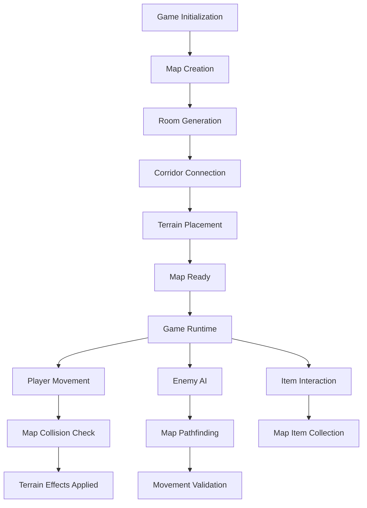

# Procedural Dungeon Generation System Design

## Overview
This document describes the design of a procedural dungeon generation system inspired by NetHack, using `map.py` as the foundation for dungeon representation and integrating with `game.py` for gameplay.

## System Components

### 1. Dungeon Representation (map.py)
The `Map` class serves as the foundation for dungeon representation with these key features:
- Grid-based structure with configurable width and height
- Support for multiple generation modes (maze or rooms/corridors)
- Terrain type management with special effects
- Lighting and animation systems
- Collision detection and item collection

### 2. Room Generation Algorithm
NetHack-style room placement with these constraints:
- Variable room sizes (4-8 width, 4-6 height)
- Non-overlapping room placement
- Minimum of 5 rooms per dungeon level
- Room wall construction with proper boundaries

### 3. Corridor Connection Strategy
Guaranteed connectivity between rooms:
- Center-point connection algorithm
- Horizontal-first, then vertical corridor creation
- Ensured path between all rooms

### 4. Terrain and Item Placement
Special terrain distribution with these probabilities:
- Water (W): 8% of open areas
- Trees/Foliage (T): 15% of open areas
- Rough terrain (R): 25% of open areas
- Health pickups (H): 35% of open areas
- Ammo pickups (A): 42% of open areas
- Power-ups (P): 45% of open areas
- Lava (L): 48% of open areas
- Spikes (S): 54% of open areas

### 5. Monster Spawning System
Enemy distribution with weighted probabilities:
- Basic enemies: 30%
- Fast enemies: 25%
- Tank enemies: 15%
- Sniper enemies: 15%
- Healer enemies: 10%
- Stealth enemies: 5%

Spawn constraints:
- Maximum of 5 enemies at any time
- 5% spawn chance per turn
- Spawn distance of 15-25 tiles from player

## Integration Points with game.py

### Initialization Flow
1. Game creates a new `Map` instance with specified dimensions
2. Map automatically generates rooms and corridors
3. Terrain features are added to the grid
4. Player is positioned in a central location
5. Initial enemies are placed at fixed positions
6. Items are randomly distributed throughout the map

### Runtime Integration
- Map provides collision detection for movement
- Terrain effects are applied through `get_terrain_effect()` and `get_terrain_damage()`
- Item collection is handled through `collect_item()`
- Enemy AI uses map data for pathfinding and movement decisions

## Architectural Diagram

## Implementation Guidelines

### For Developers

#### Extending Room Generation
To add new room types:
1. Modify the `generate_rooms()` method in `map.py`
2. Add new room creation functions following the existing pattern
3. Ensure new rooms are properly connected to the existing corridor system

#### Adding New Terrain Types
To introduce new terrain types:
1. Add new character codes to the terrain placement section in `generate_maze()`
2. Update `get_terrain_effect()` and `get_terrain_damage()` methods with new terrain behaviors
3. Add new cases to `_get_display_char()` and `_get_color_pair()` for visual representation
4. Update the terrain legend in `game.py` status display

#### Balancing Monster Spawning
To adjust enemy distribution:
1. Modify the `enemy_weights` dictionary in `game.py`
2. Adjust `MAX_ENEMIES` constant to change the cap
3. Modify spawn distance parameters in the enemy spawning code

#### Performance Considerations
- The map generation algorithm is designed to be efficient for maps up to 100x100 tiles
- For larger maps, consider reducing the number of rooms or terrain features
- The flood fill connectivity check has O(n) complexity where n is the number of open tiles